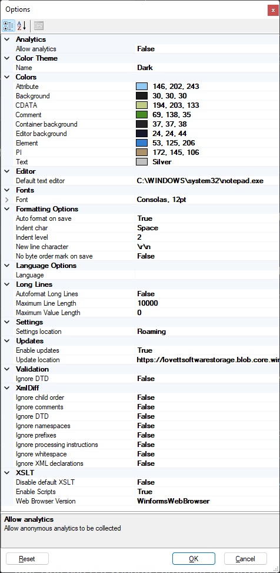

## Options

The options dialog is available from the "Options..." item under the [View Menu](menus.md).

### Analytics
Options that enable or disable the collection of analymous app usage information.  See [Analytics](analytics.md).

### Color Theme, Colors and Fonts
The options dialog allows you to select a color theme, light or dark, or configure the specific colors used in each type of node as well as the font used and the background color. A drop down arrow on each color lets you pick from different color palettes. You can also customize the font that is used in the XML Notepad tree view.

### Formatting
You can also configure the formatting options that are used when you save an XML file, or turn off formatting altogether.

### Language
Specify which language annotations to pick from associated XSD schemas.

### Long Lines
How to deal with editing of long lines.

### Updates

You can also configure the auto-update mechanism associated with
the ClickOnce installer. If the "Enable updates" field is true, then XML Notepad will ping the specified "Update Location" for an "Updates.xml" file to see if a new version of XML Notepad is available. See [Updates](updates.md) for more information on how this works.

### Validation
You can turn off DTD validation.

### XmlDiff
Options that control how the XmlDiff works when you compare XML
documents.

### XSLT
Options that control how the the XSLT Output works.
Set `Enable Scripts` to false if you don't trust the script code in your XSLT stylesheets.
Set the `Disable default XSLT` to true if you do not want a default XSLT transform
on documents that have no `<?xml-stylesheet` processing instruction.
Toggle the Web Browser Version to WebView2 if you have the new
[WebView2](https://developer.microsoft.com/en-us/microsoft-edge/webview2/)
component installed on your machine.
