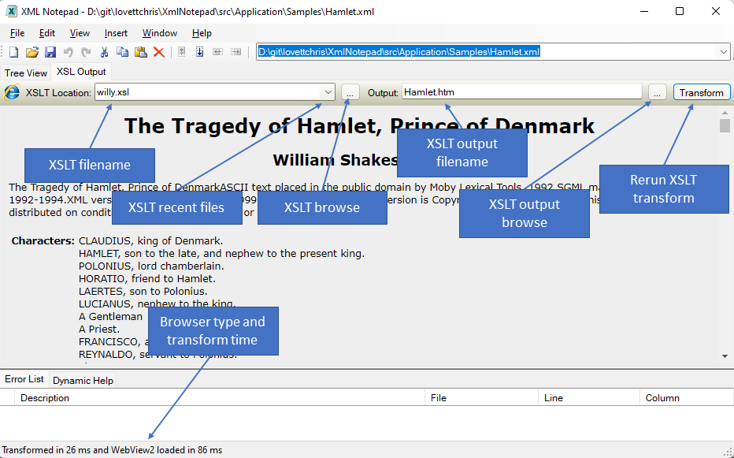

## XSLT Transformation

The `XSL Output` tab on the main window provides a rendering of the
XSLT output from the specified XSLT stylesheet.  XSLT stylesheets can
be referenced in the XML document using this syntax, as shown in the
`hamlet.xml` sample.

```xml
<?xml-stylesheet type="text/xsl" href="willy.xsl"?>
```



You can also enter your own XSLT file name on this tab by changing the
contents of the XSLT Location field at the top of the XSLT output tab.

By default the HTML output is written to the same folder that contains
your XML file, but if that folder is not writable it writes to that
folder it will use your system `%TEMP%` folder.

You can customize the default output file name by adding the following
additional processing instruction to your XML document:

```xml
<?xsl-output default="hamlet"?>
```

Then depending on the `<?xsl-output method="..."` the appropriate file
extension will be added.  You can also override this by directly
editing the Output: text box.  If you modify the XML or XSLT file you
can press the `Transform` button to perform another XSLT
transformation and the changes will be rendered.

This tab supports 2 different web browser engines.  The original
WinForms web browser and the new Chromium based WebView2.  The new
WebView2 control is much faster on large XSLT outputs.

XML Notepad does not automatically install this new WebView2
component.  Please see [Microsoft Edge
WebView2](https://docs.microsoft.com/en-us/DeployOffice/webview2-install)
for information on how to install this optional component.
